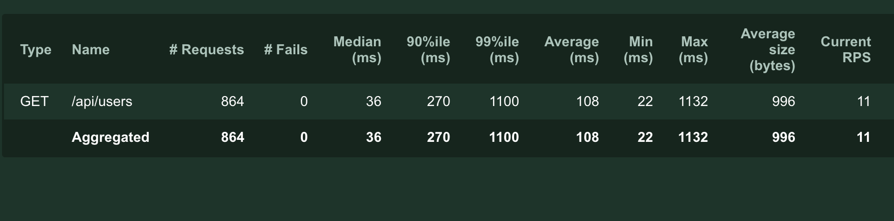
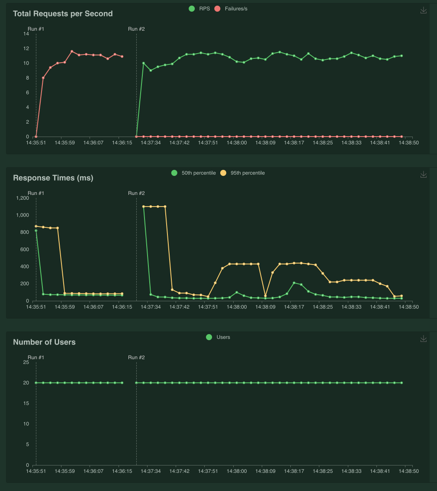

# tp-testing-mds

# Locust

Nous utilisons locust car c'est un outil super performant, il est également facile à utiliser et facile à installer à l'aide de docker

### Test

- Host : https://reqres.in/api
- Number of users: 20 (Utilisateurs que on attends se connect a simutanement a l'api)
- Spawn rate : 100
- Api route: /users

Run docker container in the locust folder

```
docker run -p 8089:8089 -v $PWD:/mnt/locust locustio/locust -f /mnt/locust/locustfile.py
```

### Results



